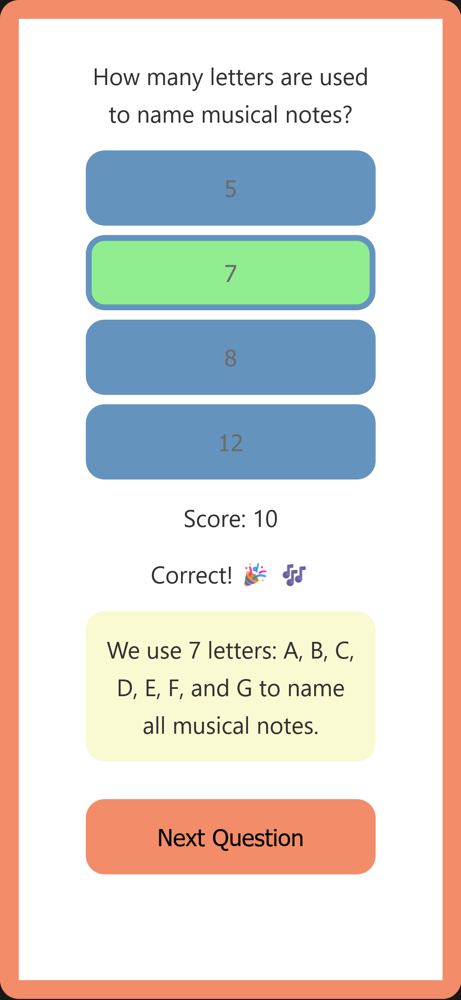

# music-theory-quiz

This template should help get you started developing with Vue 3 in Vite.

## Recommended IDE Setup

[VSCode](https://code.visualstudio.com/) + [Volar](https://marketplace.visualstudio.com/items?itemName=Vue.volar) (and disable Vetur).

## Type Support for `.vue` Imports in TS

TypeScript cannot handle type information for `.vue` imports by default, so we replace the `tsc` CLI with `vue-tsc` for type checking. In editors, we need [Volar](https://marketplace.visualstudio.com/items?itemName=Vue.volar) to make the TypeScript language service aware of `.vue` types.

## Customize configuration

See [Vite Configuration Reference](https://vite.dev/config/).

## Project Setup

```sh
npm install
```

### Compile and Hot-Reload for Development

```sh
npm run dev
```

### Type-Check, Compile and Minify for Production

```sh
npm run build
```

### Run Unit Tests with [Vitest](https://vitest.dev/)

```sh
npm run test:unit
```


 ## Table of contents

- [Overview](#overview)
  - [The challenge](#the-challenge)
  - [Screenshot](#screenshot)
  - [Links](#links)
- [My process](#my-process)
  - [Built with](#built-with)
  - [What I learned](#what-i-learned)
  - [Continued development](#continued-development)
  - [Useful resources](#useful-resources)
- [Author](#author)
- [Acknowledgments](#acknowledgments)


### Overview

Music theory quiz app - learn and build with Vue.js


### The challenge

Components:
 - App.vue: Decides whether to show Quiz.vue OR Results.vue
 - Quiz.vue: Manages all the quiz data and logic
 - Results.vue: Just displays the final score

Component responsibilities:

App.vue:
 - State: isQuizComplete (boolean), score
 - Logic: Show Quiz OR Results based on completion

Quiz.vue:
 - State: questions, currentQuestionIndex, score, answered, selectedAnswer
 - Props: score
 - Logic: Question display, answer validation, progression, completion detection
 - Handles all quiz interactions internally
 - Emit: score, quiz complete

Results.vue:
 - Props: score
 - Logic: Calculate percentage, show performance feedback
 - Events: @restart (emits back to App)

### Screenshot




### Links

Project locations:
- [Github](https://github.com/casserole27/music-theory-quiz)
- [Live Site](https://music-theory-quiz-nine.vercel.app/)

## My process

- Create Github repository
- Create requirements
- setup Vue / TypeScript using Vite 
- Project work using Github issues as "tickets"
- Publish live URL
- Check accessibility
  -(https://wave.webaim.org/)
- README file

### Built with
- Github using command line
- semantic HTML5
- CSS custom properties
- Responsive Web Design
- Vue.js
- accessibility

### What I learned
I worked with React for two years in production, but I'm playing around with the Vue.js tutorial in their docs as well as building this app. I'm also using Claude to ask questions and compare it to React to solidify my understanding.

There are things I like a lot so far that seem a little more intuitive than React. Perhaps direct mutations could become tricky in large scale production, but I like that there are no state setter functions. Props seem straightforward as well, and I really like emits, it makes a lot of sense to transmit data back up to a parent.
 
I also really like the way Vue automatically tracks dependencies using computed(), similar to React's useMemo for caching expensive calculations only when needed, but Vue doesn't use the dependency array...it automatically detects reactive properties.

### Continued development

- continued Unit testing
- convert to full-stack with PHP / Laravel

### Useful resources

 - [Vue.js documentation](https://vuejs.org/guide/introduction.html)
 - Claude Code CLI for explanations and solidifying learning

## Author

- Website - [C Lewis](https://casserole27.github.io)
- LinkedIn - [LinkedIn](https://www.linkedin.com/in/clewisdev/)

## Acknowledgments
